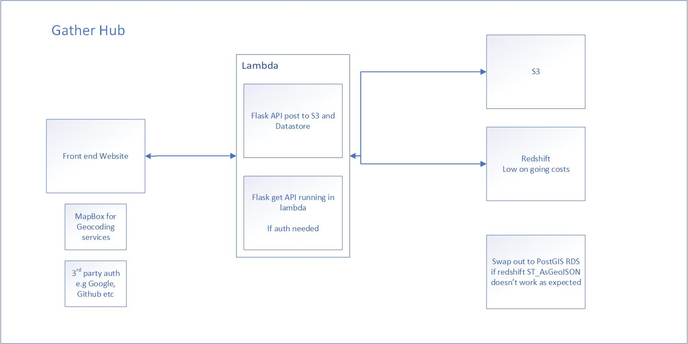

# geovation

Vue JS project that lets users add points and view existing locations of toilets from S3. 

You will need a valid mapbox account token and place in the index.vue at "MAPBOX KEY GOES HERE"


##Architecture for Gather HUB




## Project setup
```
yarn install
```

### Compiles and hot-reloads for development
```
yarn serve
```

### Compiles and minifies for production
```
yarn build
```

### Lints and fixes files
```
yarn lint
```

### Customize configuration
See [Configuration Reference](https://cli.vuejs.org/config/).
